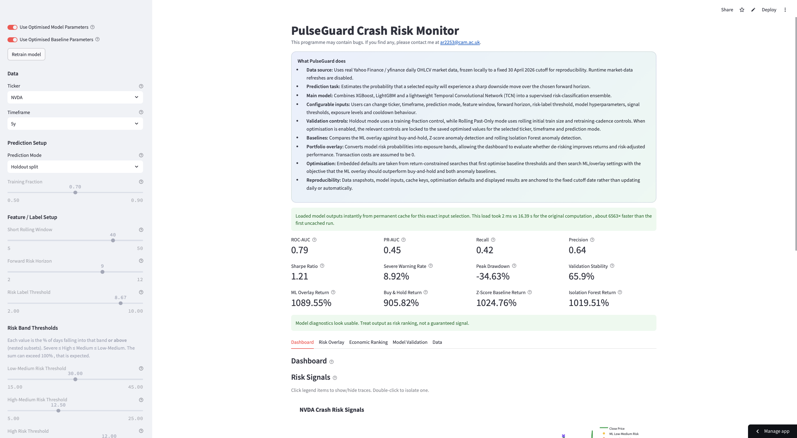
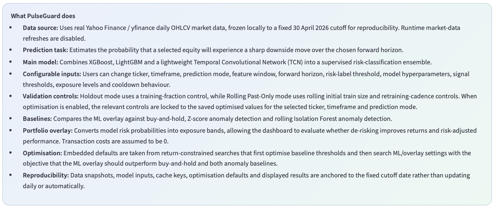
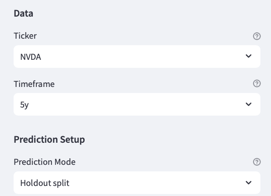
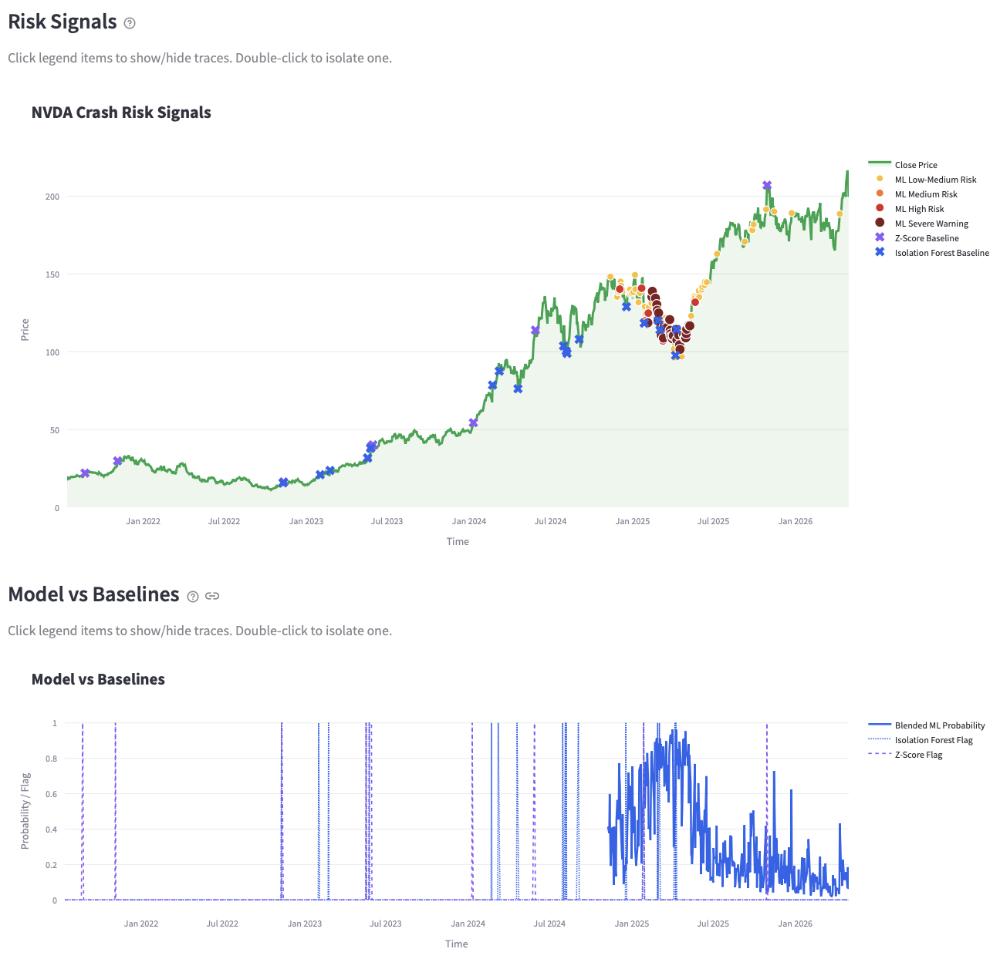
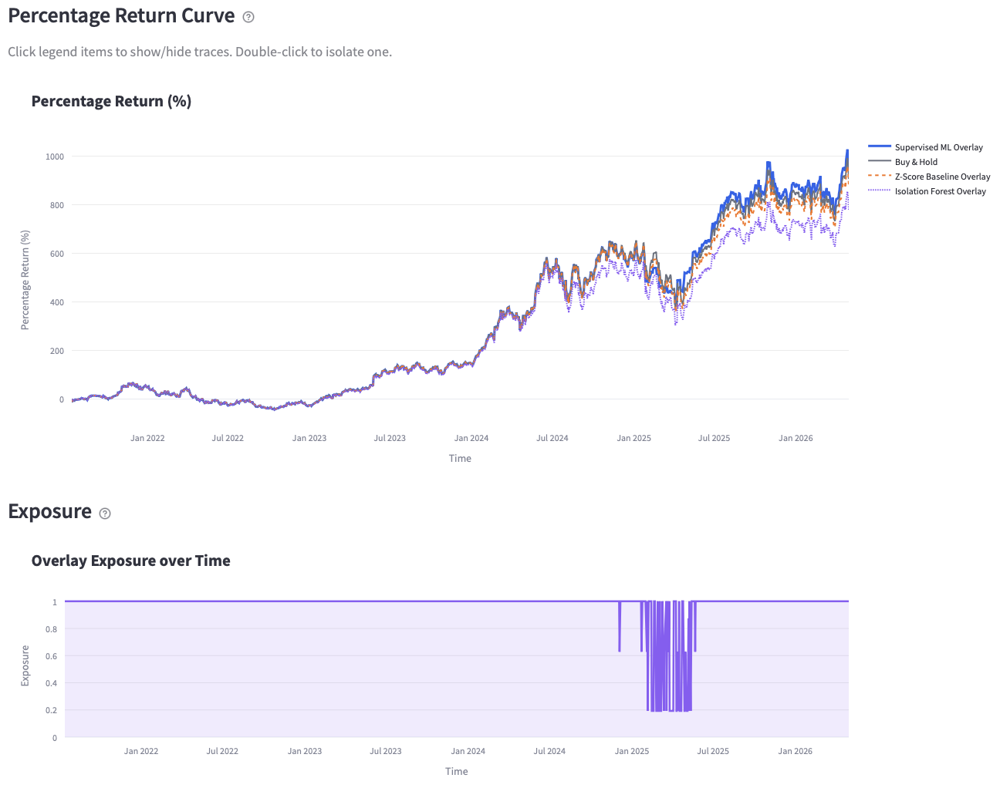
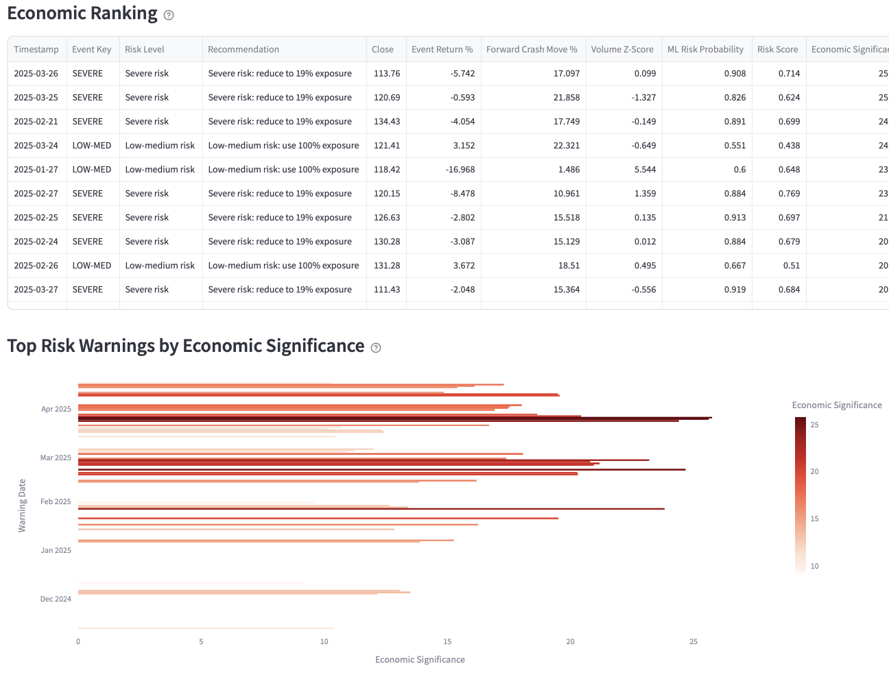
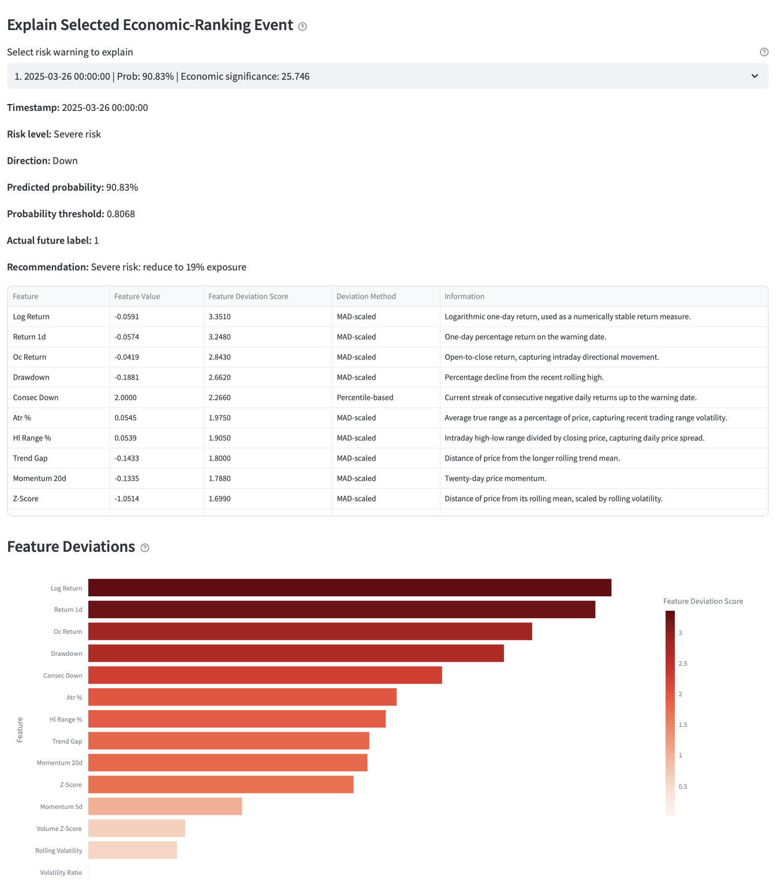
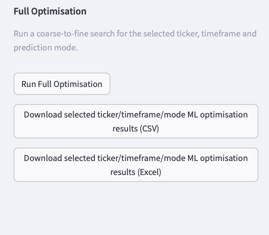

# PulseGuard Risk Monitor — Public Recruiter Codebase Scaffold

> **Public-facing repository notice**  
> This repository is a public-facing, recruiter-review version of a larger private codebase. It has been reorganised with AI assistance to improve readability and to remove production implementation details that are not intended for public release.

**Fully working deployed version:** https://crash-monitor.streamlit.app  
**Purpose of this repo:** recruiter-readable technical codebase, not a cloneable replacement for the deployed app.

## Main deployed dashboard

The first screen below is the main dashboard state when PulseGuard is loaded with a selected ticker, timeframe and prediction mode. It shows the headline model diagnostics, cache status, risk summary metrics and the first dashboard tab used to inspect market crash-risk signals.



## Why this repository exists

The deployed application is already accessible publicly, so this repository is **not** trying to provide another stripped-down working app. Its purpose is narrower: to let recruiters inspect representative code organisation, feature-engineering style, modelling structure, backtest/simulation design and documentation quality without exposing the exact implementation that powers the live system.

In other words:

- the **live app** proves the product works;
- this **public scaffold** proves the architecture and coding approach;
- the **private repo** contains the full implementation.

## Method summary and reproducibility controls

The deployed app includes an explanatory panel describing the data source, prediction task, ensemble model, validation mode, baselines, optimisation process and reproducibility design. This makes the public-facing dashboard self-contained for reviewers who want to understand what the model is doing before inspecting the code.



## What recruiters can inspect here

This repository shows the project in a modular form instead of exposing the original long Streamlit file:

```text
PulseGuard_Risk_Monitor_Model_Public/
├── app/
│   ├── app_structure.py          # public Streamlit scaffold, not production app
│   ├── page_overview.py          # UI section structure
│   ├── page_model.py             # model-page structure
│   └── page_backtest.py          # simulation/backtest-page structure
├── src/
│   ├── data_loader.py            # public data-loading abstraction
│   ├── feature_engineering.py    # representative OHLCV feature engineering
│   ├── model_pipeline.py         # simplified model-training interface
│   ├── risk_metrics.py           # public risk metric helpers
│   ├── overlay_backtest.py       # simplified overlay simulation structure
│   ├── visualisation.py          # plotting helpers
│   ├── optimisation_pseudocode.py# detailed pseudocode for withheld optimiser
│   └── cache_pseudocode.py       # detailed pseudocode for withheld cache logic
├── docs/
│   ├── architecture.md
│   ├── methodology.md
│   ├── pseudocode_walkthrough.md
│   ├── recruiter_notes.md
│   └── diagrams/
├── tests/
│   └── test_public_pipeline.py
└── LICENSE
```

The sidebar exposes the core configuration controls used by the deployed app, including ticker, timeframe and prediction-mode selection. These controls determine which cached model artefacts, risk labels and overlay settings are loaded.



## What is intentionally withheld

The following are deliberately omitted or converted into pseudocode:

- the exact production Streamlit app file;
- full simulation branch logic;
- full coarse-to-fine optimisation search;
- complete walk-forward threshold calibration;
- production cache keys, invalidation rules and persisted artefact handling;
- exact hyperparameter search ranges and selection heuristics;
- generated optimisation output files;
- deployment keep-alive automation and runtime glue;
- private performance-tuning code;
- complete UI state logic for the live app.

## How to read the code

Start with these files:

1. `app/app_structure.py` — shows how the original long app is conceptually split into smaller pages.
2. `src/feature_engineering.py` — shows representative market feature construction.
3. `src/model_pipeline.py` — shows the public model-pipeline interface.
4. `src/overlay_backtest.py` — shows the public simulation/backtest structure.
5. `src/optimisation_pseudocode.py` — explains the withheld optimisation system in detailed pseudocode.
6. `docs/pseudocode_walkthrough.md` — explains how the full private simulation fits together.

## Relationship to the deployed app

The live PulseGuard Crash Risk Monitor app uses the same broad architecture represented here:

```text
Market data -> engineered features -> risk model -> calibrated risk signal ->
exposure overlay -> simulated equity curve -> comparative metrics and charts
```

The deployed dashboard visualises ML risk bands against close price movement, then compares the supervised risk probability with anomaly-detection baselines. This view is useful for checking whether the model identifies clusters of downside-risk warnings around relevant drawdown regimes rather than producing isolated, context-free alerts.



The return and exposure view evaluates whether the model-driven overlay improves the percentage-return curve relative to buy-and-hold and baseline overlays. The exposure plot shows how the app converts risk classifications into position-sizing decisions over time.



However, this public version intentionally avoids exposing the exact production implementation. It should be read as a **technical exhibit** rather than a reproducible source release.

## Deployed analytical views

The Economic Ranking tab orders warning events by model probability, realised forward move and economic significance, allowing the most material warnings to be reviewed first. This supports post-hoc inspection of whether the largest warnings correspond to economically meaningful downside events.



The selected-event explanation view breaks down an individual warning into its probability, threshold, realised label and feature-deviation drivers. This explains which engineered market features were most abnormal at the point where the model issued the warning.



The optimisation controls expose a coarse-to-fine search workflow and downloadable optimisation artefacts for the selected ticker, timeframe and prediction mode. In the full deployed system, this is used to persist selected model and baseline parameter settings without rerunning expensive searches unnecessarily.



## Local use

This repository is designed primarily for code review. Some files are executable as lightweight demonstrations, but the repo is **not expected to reproduce the deployed app**.

Optional local check:

```bash
cd ~/Downloads
unzip PulseGuard_Risk_Monitor_Model_Public.zip
cd PulseGuard_Risk_Monitor_Model_Public
python3 -m venv .venv
source .venv/bin/activate
pip install -r requirements.txt
python -m pytest tests/test_public_pipeline.py
```

Optional Streamlit scaffold view:

```bash
streamlit run app/app_structure.py
```

## Recruiter note

The full source code can be discussed in a guided walkthrough or shared privately where appropriate. This public repository is intentionally limited so that the deployed work can be evidenced without making the complete implementation trivial to copy.

## Licence

All rights reserved. This public scaffold is provided for review only and is not licensed for reuse, redistribution or derivative commercial/academic submissions.
