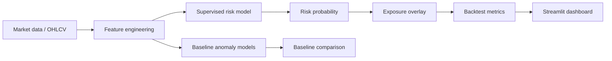

# Architecture

The public repository is structured to show how the project is organised without revealing the full private implementation.



## Private vs public boundary

| Area | Public showcase | Private deployment |
|---|---|---|
| App UI | Split into small readable pages | Full production UI and controls |
| Data | Deterministic synthetic OHLCV-style demo | Real market data / frozen snapshots |
| Features | Compact feature subset | Full engineered feature set |
| Model | Lightweight Random Forest demo | Fuller ensemble and calibration flow |
| Optimisation | Detailed pseudocode | Coarse-to-fine executable optimiser |
| Caching | Detailed pseudocode | Persistent model/result cache |
| Results | No generated optimisation outputs | Full CSV/JSON result artefacts |
```
